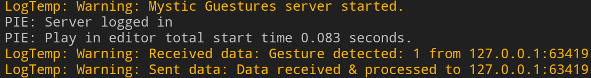
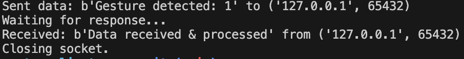

# Example inter-communication via UDP


This repo shows example code for inter-communcation between a Python client and Unreal Engine server via a UDP socket.

Both examples using local IP address & port `65432`.

## Dependencies
`Networking` & `Sockets` UE modules.
```c++
PublicDependencyModuleNames.AddRange(new string[] {
    ..., "Networking", "Sockets"
});
```

## Proof of Concept
### UE Output logs

### Python script logs
