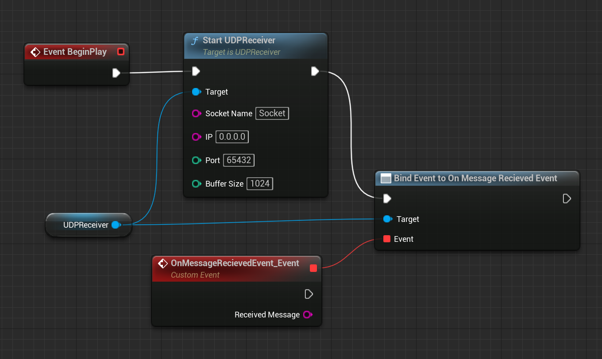

# UE Inter-communication via UDP Messaging

Simple actor component for Unreal Engine enabling inter-communication via UDP messaging.  This example shows using a Python client.

## Dependencies
`Networking` & `Sockets` UE modules and `socket` Python library.
## Usage
### Unreal Engine (C++)
1. Include Unreal Engine dependencies to .buid.cs file
```c++
PublicDependencyModuleNames.AddRange(new string[] {
    ..., "Networking", "Sockets"
});
```
2. Add `UDPReceiver.h` & `UDPReceiver.cpp` into project
2. Add component `UDPReceiver` to desired actor
3. Add `Start UDPReceiver` node to actor event graph
4. Bind event `On Message Received Event`



### Python
1. Import `socket` library dependency
```Python
import socket
```
2. Define socket IP address & port number
```Python
server_address = ('127.0.0.1', 65432)
```
3. Create connection to UDP socket
```Python
udp_socket = socket.socket(socket.AF_INET, socket.SOCK_DGRAM)
```
4. Send data
```Python
udp_socket.sendto('data', server_address)
```
5. Recieve response
```Python
data, server = udp_socket.recvfrom(1024)
```
6. Close socket connection
```Python
udp_socket.close()
```

## Proof of Concept
### UE Output logs

### Python script logs
